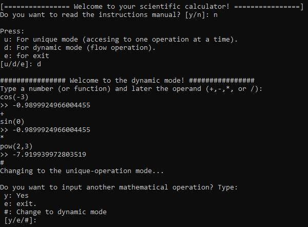
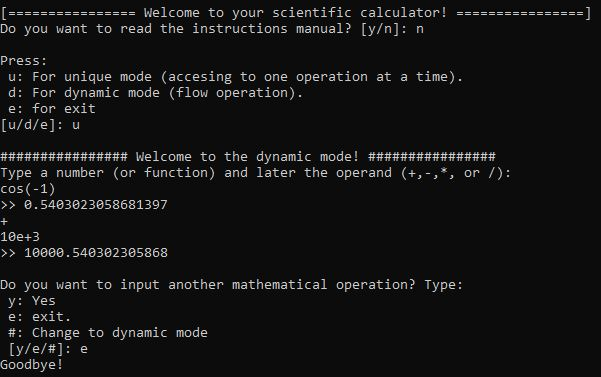
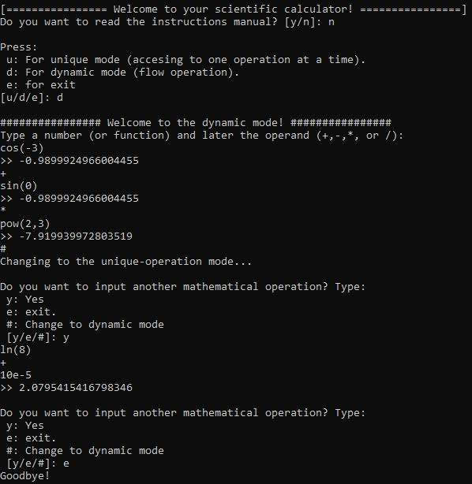
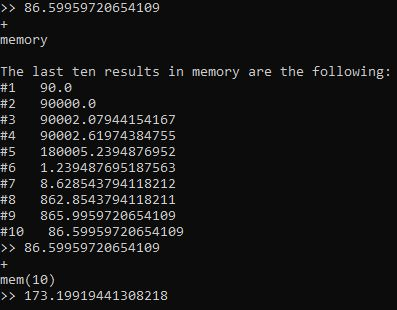
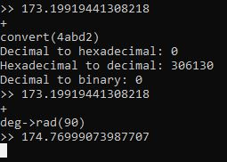

# Overview 
## Scientific Calculator in Java without Math library.
This repository holds the code for executing a CLI-based scientific calculator that supports a wide variety of functions, which are:
* Addition
* Substraction
* Multplication
* Division
* Modulus
* Cosine function
* Sinusodial function
* Tangent function
* Logarithm base 10 
* Logarithm base n 
* Natural logarithm
* Exponential function
* Factorial
* Square root
* N-th root
* Exponential 
* Convert from radians to degrees and viceversa
* Pi
* Euler's number
* Memory of last 10 results
* Scientific notation.
* Conversion among decimal, hexadecimal and binary
Also, supports 2 modes: dynamic (which allows to make a flow of operations) and a unique-operation mode (which allows to do one operation).
## Examples:
### Dynamic mode:
 

### Unique-operation mode:
 

### Swtich from dynamic to unqie-operation mode:
 

### Show last ten results and accesing to memory

### Convert from hexadecimal to decimal and from degrees to radians 

## Dependencies
* Java

## Usage
### Step 1 - Clone repository

###### git clone https://github.com/SebasGarcia08/Scientific-Calculator-in-Java.git

### Step 2 - Compile program 

###### javac {your-download-directory-path}\Scientific-Calculator-in-Java\bin\Calculator.java

### Step 3 - Run program
###### java {your-download-directory-path}\Scientific-Calculator-in-Java\bin\Calculator'

## INITIAL MANUAL 
So far, this command-based scientific calculator supports 18 functions. Let's take an overview of the overall structure and then how each one works:

The basic structure of this calculator is the following:

###  Example instuctions
#### FUNCTION tan(real number) Example:
tan(-1) = -1.557 //in radians

#### FUNCTION ln(POSITIVE real number) Example:
ln(2) = 0.69

#### FUNCTION rt(index : POSITIVE real number, radicand: POSITIVE real number if index is even, NEGATIVE real number if index is odd) Example:
rt(3,-8) = 2

#### FUNCTION fact(integer number) Example:
fact(4)=24

#### COMMAND  memory Example:

#### FUNCTION log(base: real number, n: real number) Example:
log(5,25) = 2.0

#### CONSTANT e Example:
e = 2.71828182845905

#### FUNCTION cos(real number) Example:
cos(-1) = 0.5403023059 //in radians

#### FUNCTION log10(POSITIVE real number) Example:
log10(2) = 0.30102999257

#### FUNCTION convert(decimal or binary or hexadecimal string) Example
convert(247242)

#### FUNCTION mem(1:first result or 10:last result) This function returns the result at position passed. Example:
mem(10) = 3

#### FUNCTION sqrt(POSITIVE real number) Example:
sqrt(2) = 1.4

#### FUNCTION deg->rad(degrees) Example:
deg->rad(90) = -0.44

#### FUNCTION sin(real number) Example:
sin(-1) = -0.8414709848 //in radians

#### FUNCTION pow(base: real number, exponent: real number) Example:
pow(2, -1) = 0.5

##### CONSTANT pi  Example:
pi = 3.14159265358979323846

#### FUNCTION exp(real number) Example:
exp(-2)
>>0.13

#### FUNCTION rad->deg(radians) Example:
deg->rad(-0.44) = 90

if you want to remember how x function works, type help(x) and get and example.

## Credits
Sebastián García Acosta

